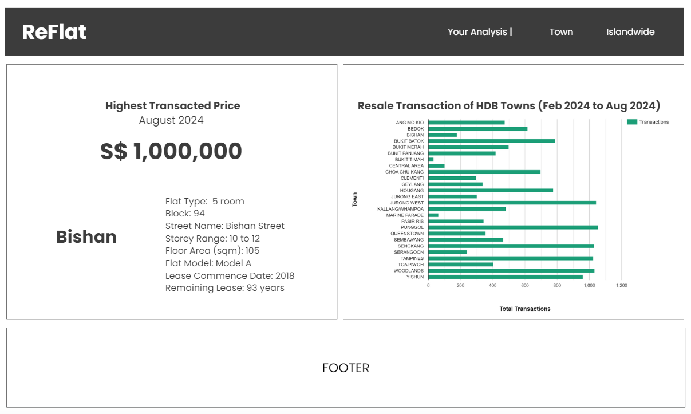
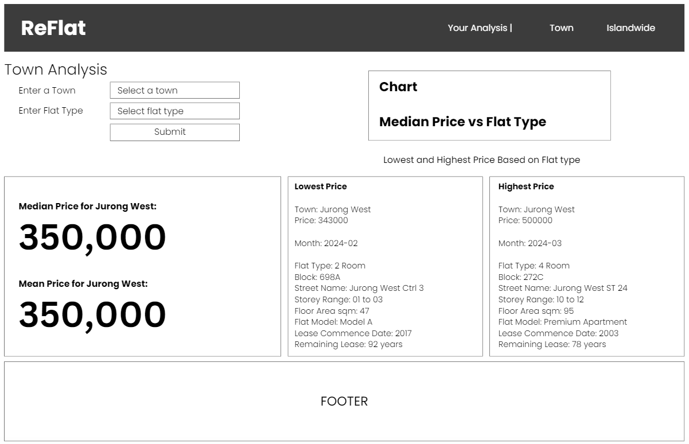
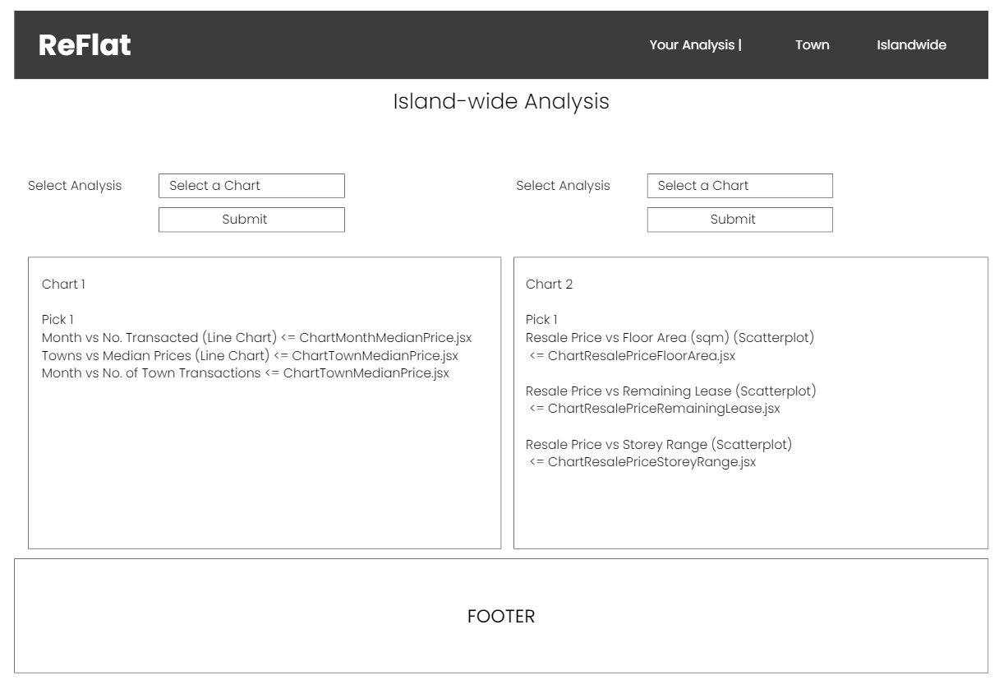

# Re.FLAT

## Project Description

Build a web application Re.FLAT, which is a resale flat information and analysis portal aim to provide user with information about the recent HDB resale flat transactions.

## Project MVP

The app is built with React with at least

- 5 components
- 4 props
- 2 useStates
- 2 react router routes
- 1 lifting state, which is used to implement CRUD on the client side

- The app calls an API and displaying the data for the user.
- The app has at least 1 CUD (Create, Update, Delete) functionality using Airtable (but NOT the airtable client)
- The app is deployed online so that the rest of the world can use it.

## User Stories (in components)

<b>Last Month Transactions</b>

1. Show last month's total transaction count.
2. Show last month's highest transaction price.

<b>Town Analysis</b>

1. Enable user to filter the data based on their preferred "town" and "flat types".
2. Enable user to bookmark their favourite filter for future reference as well as compare it with a new filter.
3. Filtered result will provide user with the following:
   - aggregate result
   - highest and lowest price

<b>Islandwide Analysis</b>

1. Show charts on islandwide transactions

## Timeframe

- 7 days

## Technologies Used

- Javascript
- CSS
- React JS
- Virtual Studio Code
- Git/GitHub
- Vercel (WEB Deployment)
- Bruno (fetching, CRUD API)

## API Used

- API from gov sg open data
  - https://beta.data.gov.sg/datasets/d_8b84c4ee58e3cfc0ece0d773c8ca6abc/view
- Air table for data storage made by the user/app
  - https://airtable.com

## Libraries Used

- React Router
- React Bootstrap
- React Google Charts
- Date fns

## Wireframe

For my wireframe, I used Canva to create an initial layout of what it will look like:

